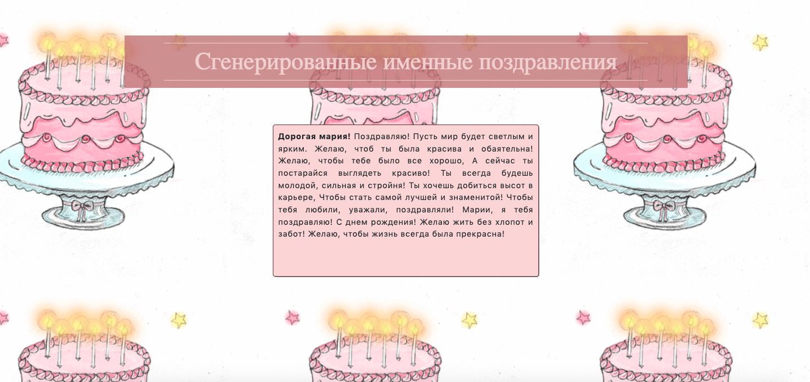

## Генератор поздравлений GPT2

* **Сбор и предобработка данных:**
  * Парсинг данных для проекта проводился с сайта [zedra.ru](https://zedra.ru/po-imenam/). 
  * Датасет был обработан и подан в модель.
* **Обучение:**
  * Использована 'sberbank-ai/rugpt3small_based_on_gpt2', дообученная на своём датасете.
* **Реализация:**
  * С помощью фреймворка Flask сделан сайт.
  * Сайт использует дообученную модель GPT-2 и выдаёт пользователю предсказание на основании введенной пользователем фразы.

Результат:

